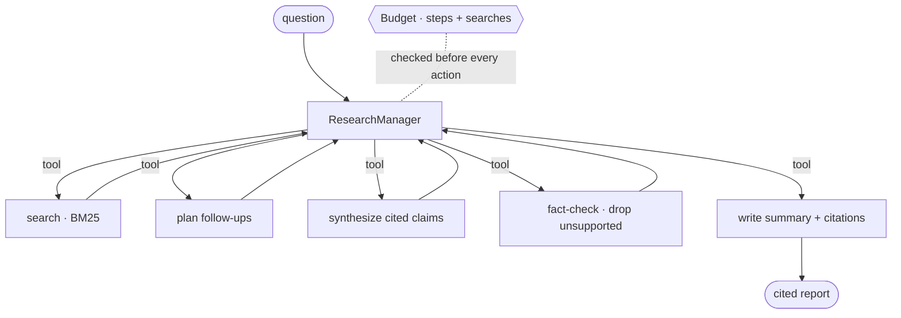

# deep-research-agent

> **The manager pattern, done with guardrails on cost and truth.** A coordinator
> orchestrates planner / searcher / synthesizer / fact-checker / writer sub-agents
> (agents-as-tools) under a **hard step + search budget**, and every claim in the final
> report is **traced to a cited source**. Faithfulness and budget are gated in CI.
> **Fully offline, zero API keys.**

[](https://github.com/tahasiddiquii/deep-research-agent/actions/workflows/ci.yml)


"Deep research" agents are easy to demo and hard to trust: they wander, run up token bills,
and cite things they didn't read. This one is built around the two failure modes that
actually matter — **runaway cost** and **hallucinated claims** — and gates both.

## What this demonstrates

| Production principle (2026 agent playbooks) | Where |
| --- | --- |
| Manager pattern — coordinator + agents-as-tools | [manager.py](src/research_agent/manager.py) |
| Hard cost budget (steps + searches), checked per action | [schemas.py](src/research_agent/schemas.py) · `Budget` |
| Iterative deepening (follow up on what you found) | [agents.py](src/research_agent/agents.py) · `plan_followups` |
| Faithfulness by construction (extract + fact-check) | [agents.py](src/research_agent/agents.py) |
| Every claim cited; faithfulness gated in CI | [evals.py](src/research_agent/evals.py) |

## Architecture



## Quickstart

```bash
make dev            # venv + install -e ".[dev]"

research-agent research "How can you reduce the inference cost of large language models?"
research-agent eval        # faithfulness · citation · coverage · budget gate
research-agent demo
```

No keys, no network — retrieval is BM25 over a committed corpus and synthesis is extractive
by default. Set `RESEARCH_PROVIDER=openai` to synthesize with a model (the fact-check stays
deterministic).

## Evaluation

`research-agent eval` runs the manager over labeled questions
([report](reports/research_report_example.md)):

| metric | value | threshold |
| --- | --- | --- |
| faithfulness | 1.000 | ≥ 0.99 |
| citation_rate | 1.000 | ≥ 0.99 |
| budget_respected | 1.000 | = 1.00 |
| coverage | 0.800 | ≥ 0.60 |
| avg_searches | 4.0 | (ceiling 6) |

**Every claim traces to a cited source (faithfulness 1.0), no run exceeds its budget, and
coverage is an honest 0.80** — a bounded search doesn't always surface every relevant
document, and the report says so rather than pretending. Numbers are produced by the run.

## Why faithfulness is 1.0 — and why that's the point

Claims aren't free-form text. The synthesizer **extracts** the most relevant sentence from
each retrieved source and tags it with that source's id; the fact-checker then **drops any
claim not supported by its citation**. So faithfulness is 1.0 *by construction*. The gate
exists to keep it there when you swap the extractive synthesizer for an LLM — which *can*
hallucinate — because the deterministic fact-check remains the backstop.

## Design decisions

- **Budget is a first-class object.** Every search and sub-agent call spends from a `Budget`
  with hard ceilings, checked before acting — the cost-control the 2026 guides insist on.
- **Manager owns the loop.** Specialists are tools; only the coordinator drives the workflow
  and talks to the caller. Easy to reason about, easy to bound.
- **Iterative deepening.** The manager searches the question, then generates follow-up
  searches from what it found — until the budget says stop.
- **Honest coverage.** It's reported and gated at a realistic bar (0.60), not inflated.

## Layout

```
src/research_agent/  corpus · agents · manager · schemas · evals · report · cli
data/  corpus.jsonl · questions.jsonl
reports/  research_report_example.md
```

## Related repositories

Part of a portfolio on production ML & LLM engineering:

- [ai-harness](https://github.com/tahasiddiquii/ai-harness) · [llm-eval-observability](https://github.com/tahasiddiquii/llm-eval-observability) · [llm-guardrails-redteam](https://github.com/tahasiddiquii/llm-guardrails-redteam) · [hybrid-graph-rag](https://github.com/tahasiddiquii/hybrid-graph-rag)
- [support-copilot](https://github.com/tahasiddiquii/support-copilot) · [invoice-ap-agent](https://github.com/tahasiddiquii/invoice-ap-agent)
- [timeseries-forecasting](https://github.com/tahasiddiquii/timeseries-forecasting) · [tabular-ml](https://github.com/tahasiddiquii/tabular-ml)
- **deep-research-agent** — this repo.

## License

MIT © 2026 Taha Siddiqui
