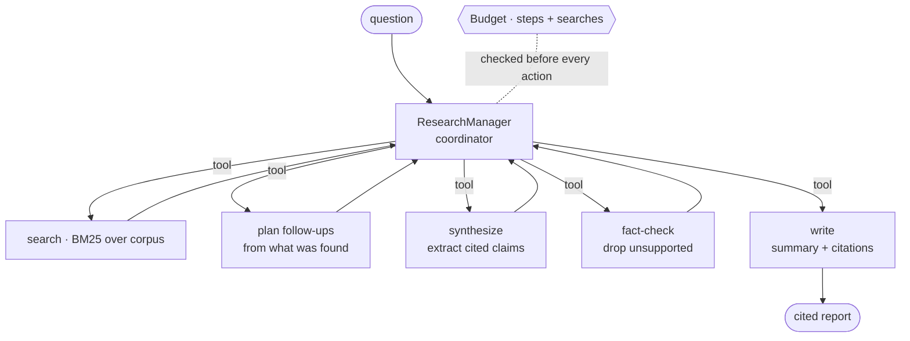

# Architecture

The manager pattern, and the guarantees that keep a research run honest and bounded.

## The manager pattern

A single coordinator owns the workflow and invokes specialists as tools — the
[manager pattern](https://openai.com/business/guides-and-resources/a-practical-guide-to-building-ai-agents/)
from the 2026 agent playbooks. No specialist talks to the user or controls the loop; the
manager does, which keeps the flow easy to reason about and to bound.

## Budget as a first-class concern

Token/compute cost is the thing that quietly explodes in agentic research. Here every
action — each search, each sub-agent call — spends from a [`Budget`](src/research_agent/schemas.py)
with hard step and search ceilings, checked *before* the action. The manager does
iterative deepening (search the question, then follow up on what it found) but stops the
moment the budget is hit. `budget_respected` is gated at 100%.

## Faithfulness by construction

Claims are not free-form generations — the synthesizer **extracts** the most relevant
sentence from each retrieved source and tags it with that source's id, and the
fact-checker then **drops any claim not supported by its cited source**. So every claim in
the final report traces to a citation, and `faithfulness` is 1.0 by construction. The gate
enforces it stays that way if you later swap the extractive synthesizer for an LLM (which
*can* hallucinate) — the deterministic fact-check remains the backstop.

## What the eval measures

[evals.py](src/research_agent/evals.py) runs the manager over labeled questions and scores:

| metric | what it means | gated |
| --- | --- | --- |
| faithfulness | every claim supported by its cited source | ≥ 0.99 |
| citation_rate | every claim carries a source | ≥ 0.99 |
| budget_respected | no run exceeds the ceiling | = 1.0 |
| coverage | fraction of expected points the budgeted search surfaced | ≥ 0.60 |

Coverage is the honest quality signal — it sits below 1.0 because a bounded search doesn't
always surface every relevant document, which is exactly the cost/quality trade-off the
budget makes explicit.
